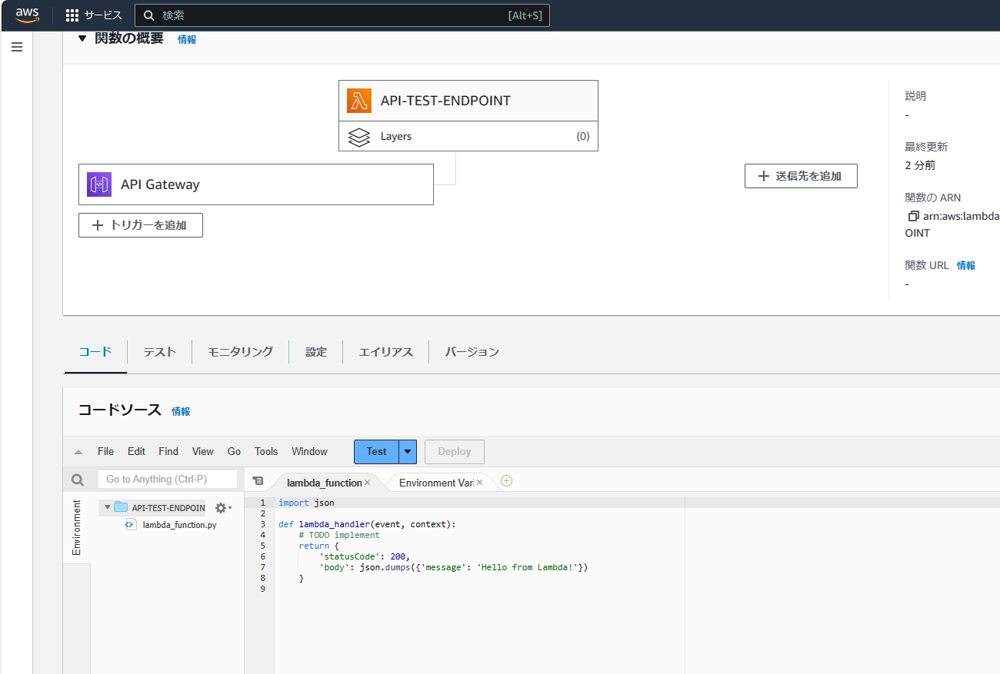
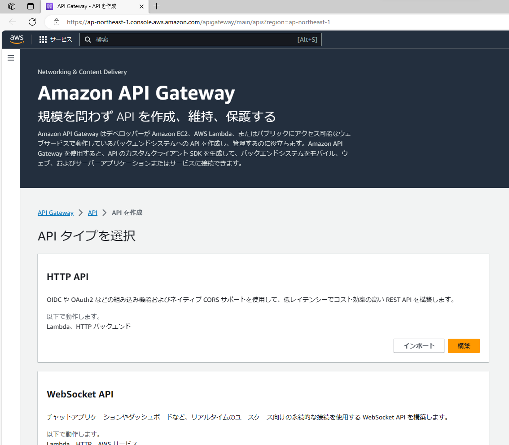
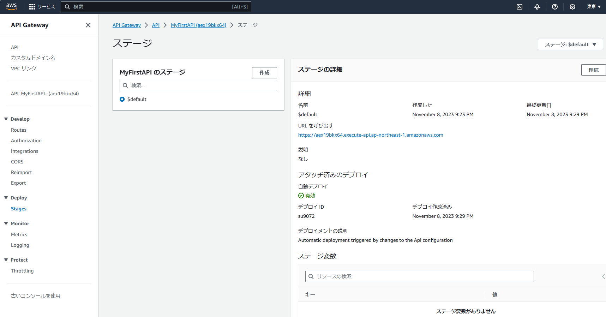
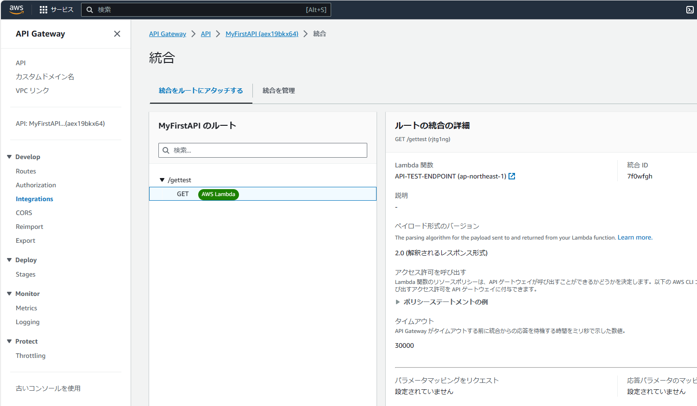
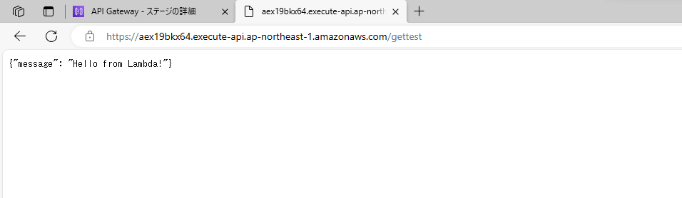

+++
author = "DUAN DAHAI"
title = "Use AWS lambda as api endpoint"
date = "2023-02-07"
description = "Use AWS lambda as api endpoint"
tags = [
    "AWS",
    "Lambda",
    "API"
]
categories = [
    "solutions"
]
+++

[AWS Lambda](https://docs.aws.amazon.com/lambda/latest/dg/welcome.html) + [API Gateway](https://docs.aws.amazon.com/apigateway/latest/developerguide/welcome.html) can easily and quickly build your api servcie.   
You can find the the introduce and Benefits on aws documents.   
I will just show you how eazy to build a api in this article.

### Create a python lambda by your fastest way

### Create a HTTP API by AWS API Gateway

### when creating the HTTP API, use the default stage and default settings

### add a test rout linked to python lambda as the endpoint

### then test your api in browser, connected backend lambda successfully!
