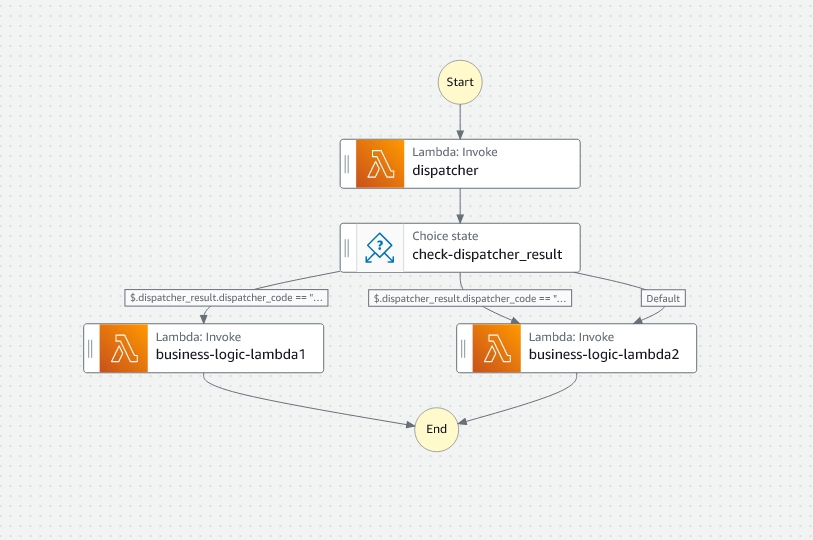

+++
author = "DUAN DAHAI"
title = "Hold state input in StepFunctions"
date = "2023-03-01"
description = "Hold state input in StepFunctions"
tags = [
    "AWS",
    "Stepfunctions"
]
categories = [
    "solutions"
]
+++
 
In this case, I use the Stepfunctions as my API endpoint.   
There are 2 lambdas need to be run base one the first lambda's return code in the stepfunctions.   
All the 3 lambdas need to get the http request body data from statemachine's state input.   
So, I considered if anything can save the state input at first, then the other lambda can use it as inputPath,   
actually, no thus solution after read aws document about stepfunction.   
But I found another way can pass the state input through the lambda one by one.   

#### my case


#### my solution
+ use `ResultPath` to include the state input with result at the first lambda.
```json
"ResultPath": "$.dispatcher_result",
```
+ use `InputPath` to pass all the result to next lambda.
```json
      "InputPath": "$",
```
use this solution, the state input will be pass through the lambda one by one.   
If you want to get a part of result to next state lambda, you can also use the `Parameters` or `InputPath` to select the neccessary input.

#### all statemachine code
```json
{
  "StartAt": "dispatcher",
  "States": {
    "dispatcher": {
      "Type": "Task",
      "Resource": "arn:aws:lambda:ap-northeast-1:[myAccountId]:function:dispatcher",
      "ResultPath": "$.dispatcher_result",
      "Next": "check-dispatcher_result"
    },
    "check-dispatcher_result": {
      "Type": "Choice",
      "Choices": [
        {
          "Or": [
            {
              "Variable": "$.dispatcher_result.dispatcher_code",
              "StringEquals": "1"
            },
            {
              "Variable": "$.dispatcher_result.dispatcher_code",
              "StringEquals": "2"
            }
          ],
          "Next": "business-logic-lambda1"
        },
        {
          "Or": [
            {
              "Variable": "$.dispatcher_result.dispatcher_code",
              "StringEquals": "3"
            },
            {
              "Variable": "$.dispatcher_result.dispatcher_code",
              "StringEquals": "4"
            }
          ],
          "Next": "business-logic-lambda2"
        }
      ],
      "Default": "business-logic-lambda2"
    },
    "business-logic-lambda1": {
      "Type": "Task",
      "InputPath": "$",
      "Resource": "arn:aws:lambda:ap-northeast-1:[myAccountId]:function:business-logic-lambda1",
      "End": true
    },
    "business-logic-lambda2": {
      "Type": "Task",
      "InputPath": "$",
      "Resource": "arn:aws:lambda:ap-northeast-1:[myAccountId]:function:business-logic-lambda2",
      "End": true
    }
  }
}
```

#### Reference
You can find more information on [Input and Output Processing in Step Functions](https://docs.aws.amazon.com/step-functions/latest/dg/concepts-input-output-filtering.html).