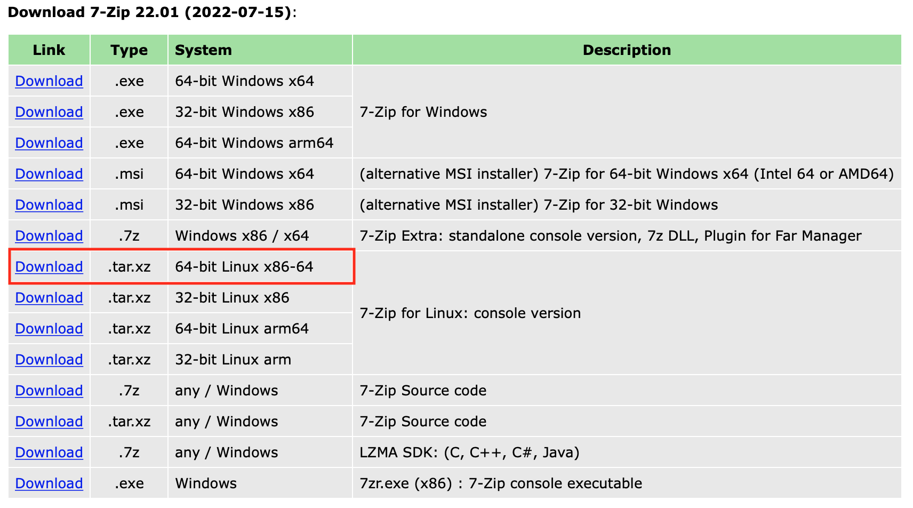

+++
author = "DUAN DAHAI"
title = "Pythonでファイルを圧縮する際のファイル名文字化け対策"
date = "2023-01-11"
description = "Pythonでファイルを圧縮する際のファイル名文字化け対策"
tags = [
    "Python",
    "パスワード付き圧縮"
    ]
categories = [
    "技術文章"
]
+++

Pythonでファイルを圧縮する際のファイル名文字化け対策をご紹介します。  

日本語名のファイルに対して、Pythonでパスワード付き圧縮を実施する場合、ファイル名の文字化けが発生しました。  
この問題はライブラリー内部仕様のため、ライブラリーを改造しないと解決できないそうですが、[外部圧縮ツール](https://sevenzip.osdn.jp)をPython実装に利用して、強力、簡単的に圧縮できることを見つかりました。

#### 外部圧縮ツール
私がAWS LambdaのPythonスクリプトに、7-zipのコマンドラインコマンドでzip処理を実施しています。
利用している7-zipツールの`7zzs`は以下のページからダウンロードしました。
+ [7zipのコマンドライン](https://www.7-zip.org/download.html)  


Windows環境にコマンドラインの利用はもちろんできます。

#### 利用方法
私が`7zzs`をS3の指定場所に保存し、zip処理で、s3からLambdaの/tmp配下にダウンロードして利用しています。  
この場合、`7zzs`の実行権限を設定する必要があるので、以下の実装をご参照ください。

#### Python実装
```
# zipツールのダウンロード実装略
# zipツールの実行権限を付与
cmd = f"chmod 755 /tmp/7zzs"
os.system(cmd)
# パスワード付きzipツールを実行する(パスワード:
123456)
cmd = "/tmp/7zzs a 日本語名ファイル.zip 日本語名ファイル.pdf -p 123456"
os.system(cmd)
```

7-zipのコマンドラインの利用紹介は、公開している[ホームページ](https://sevenzip.osdn.jp/chm/cmdline/index.htm)にご参照ください。