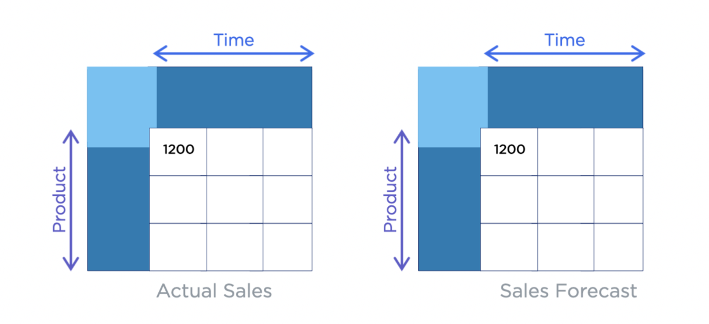
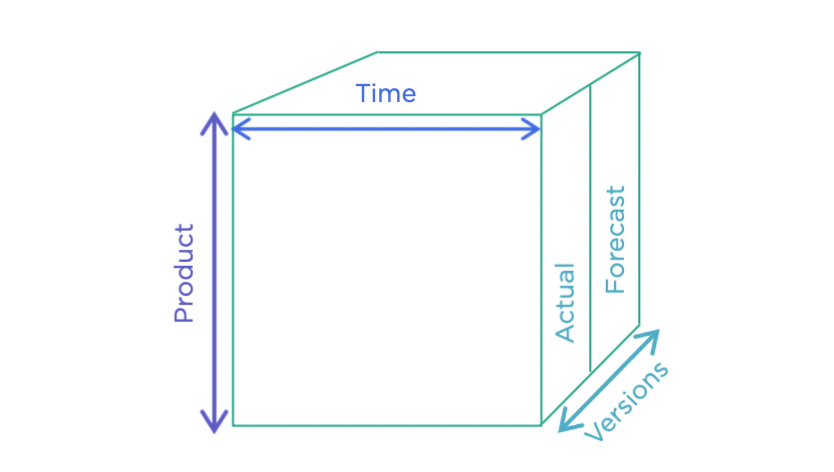

+++
author = "DUAN DAHAI"
title = "Anaplan利用感想"
date = "2023-05-01"
description = "Anaplan利用感想"
tags = [
    "DX",
    "Anaplan"
    ]
categories = [
    "ソリューション"
]
+++

DX（デジタルトランスフォーメーション）を推進する日本企業内で、業務の予測、計画を実現するために、Anaplanプラットフォームを採用して、データ分析を行うケースが少ないとはいえない。

Anaplanを実開発業務で、触って見たところ限り、以下数点の凄いや不足のところをまとめました。ソリューションを検討する際に参考ができれば嬉しいです。

##### 触ってみると凄い点
- データモジュールが３軸で表示でき、表示レイアウトが変更されても元データや合計など計算するデータが随時に再計算表示ができる。   
一般的な2次元データモジュールは、以下ようなものがあり。   

Anaplanプラットフォーム上に、データモジュールは３軸で表示できる。   

- 他に可視化機能、セイキュリティ、容量、拡張性、使いやすさなどは、一般的なプラットフォームにあるべき特性も持っています。

##### まだ不足があるところ
- 同一トランザクションの別々項目に対する複数ユーザーが同時に更新する際に、データの一貫性が確保できない。

- 複数トランザクションで更新、抽出する場合、anaplanが順番で処理終わるまで、すべての操作がお待ち状態になって、処理性能が大幅に劣化する。

- APIを利用するときにも画面の応答が遅い。

- APIのインタフェースが不足、処理能力が不安定（大量Pageデータを取得する際に、性能が不安定、サーバー側の500エラーもよく発生）。

- 大量csvファイルをAnaplan上に取り込み場合、補助ツールが自ら開発する必要、取り込み前後のデータ検証補助機能がない。

- anaplan上の数値項目、合計項目が実データと浮動小数の差異があり  
  大量データ場合、合計項目の整数部にも差異が存在する場合あり

