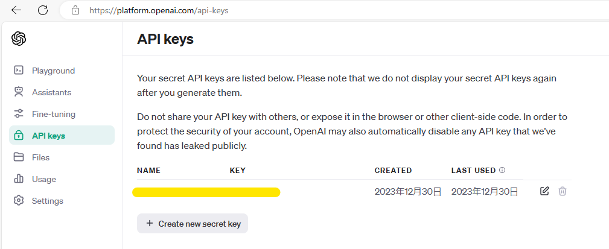
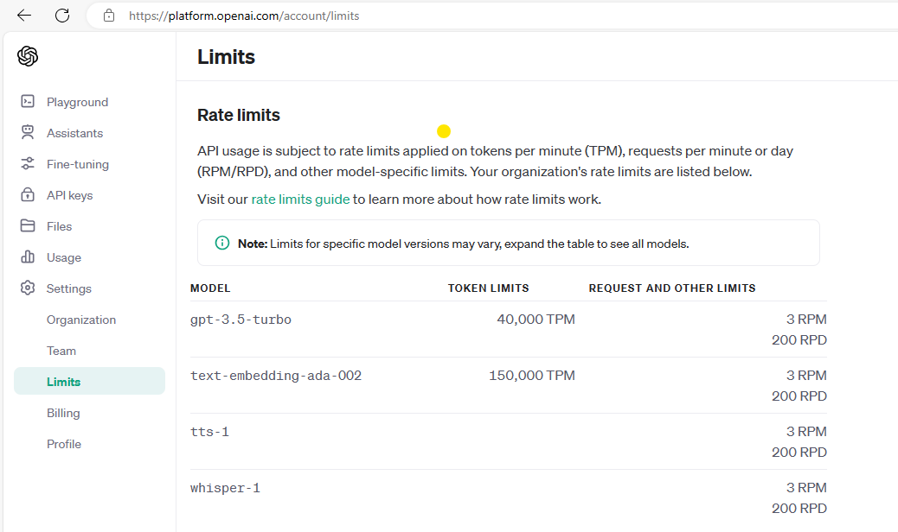
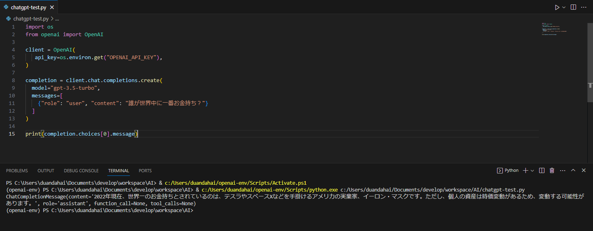

+++
author = "DUAN DAHAI"
title = "ChatGPTのAPIを触ってみる"
date = "2023-12-30"
description = "ChatGPTのAPIを触ってみる"
tags = [
    "AI",
    "ChatGPT"
    ]
categories = [
    "ソリューション"
]
+++

ChatGPTが爆発した2023年最後の日、やっとChatGPTのAPIをトライしました。
アカウント作成は[openai](https://openai.com/)サイトで特に制限がなしで作成しました。

ChatGPTのAPIを利用するため、ポータルでAPIキーを作成します。


利用できるAPIサービスは以下です。   
ChatGPT4.0 turboを一番試したいが、まだみえない。   


さっそくAPIを試してみると、いい感じですね。   



環境セットアップ面
- 基本的に[quickstart](https://platform.openai.com/docs/quickstart/developer-quickstart?context=python)を参考して設定しましたが、embeddable pythonを利用しているため、標準版pythonのvenvモジュールがない、virtualenvでChatGPT専用のpython環境を作成しました。
```
pip install virtualenv
virtualenv openai-env
.\openai-env\Scripts\activate
```

- VSCodeに作成したvirtualenv環境を利用するため、`ctrl + shift + p`で、`Python: Select Interpreter`を開いて、作成したopenai-env環境にpython.exeが存在するフォルダーを設定する必要があります。

- win11pro環境に、powershell実行権限エラーが発生するので、一応解消コマンドも共有します。   
`このシステムではスクリプトの実行が無効になっているため、ファイル C:\Users\duandahai\openai-env\Scripts\Activate.ps1 を読み込むことができません。`
```
Get-ExecutionPolicy
Set-ExecutionPolicy RemoteSigned
Get-ExecutionPolicy
```


