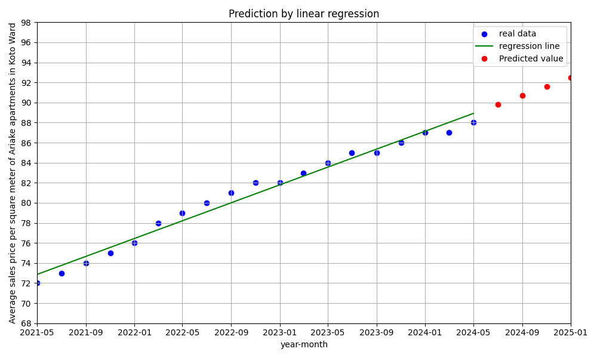

+++
author = "DUAN DAHAI"
title = "システム開発で線型近似式で業務予測を実施"
date = "2024-05-01"
description = "システム開発で線型近似式で業務予測を実施"
tags = [
    "AI",
    "linear approximation"
    ]
categories = [
    "ソリューション"
]
+++

最近のプロジェクトに、線型近似式で電力消費量を予測する処理を触っていましたので、Pythonを用いて線形近似式の使い方をこのブログで記録したいと考えています。

線形近似式は、データの傾向を直線で近似する手法です。簡単な統計手法の一つであり、過去のデータに基づいて将来の値を予測するためや、データの相関関係を理解するために広く用いられます。

#### 必要なライブラリのインストール
```
pip install numpy pandas matplotlib scikit-learn
```
#### データの準備（江東区有明マンションの平均売買㎡単価）
| 年月  | 江東区有明マンションの平均売買㎡単価 |
| ------------- | ------------- |
| 202105  | 72  |
| 202107  | 73  |
| 202109  | 74  |
| 202111  | 75  |
| 202201  | 76  |
| 202203  | 78  |
| 202205  | 79  |
| 202207  | 80  |
| 202209  | 81  |
| 202211  | 82  |
| 202301  | 82  |
| 202303  | 83  |
| 202305  | 84  |
| 202307  | 85  |
| 202309  | 85  |
| 202311  | 86  |
| 202401  | 87  |
| 202403  | 87  |
| 202405  | 88  |


#### 検証ソース（未来202407, 202409, 202411, 202501の㎡単価予測）
```
import matplotlib.pyplot as plt
import numpy as np
from sklearn.linear_model import LinearRegression
from datetime import datetime

# データの準備
x_data = [202105, 202107, 202109, 202111, 202201, 202203, 202205, 202207, 202209, 202211, 202301, 202303, 202305, 202307, 202309, 202311, 202401, 202403, 202405]
x = np.array([datetime.strptime(str(date), '%Y%m').timestamp() for date in x_data])
y = np.array([72, 73, 74, 75, 76, 78, 79, 80, 81, 82, 82, 83, 84, 85, 85, 86, 87, 87, 88])

model = LinearRegression()
model.fit(x[:, np.newaxis], y)

# 予測
x_new_data = [202407, 202409, 202411, 202501]
x_new = np.array([datetime.strptime(str(date), '%Y%m').timestamp() for date in x_new_data])
y_new = model.predict(x_new[:, np.newaxis])
print(y_new)

# 散布図と線形回帰結果の可視化
plt.figure(figsize=(10, 6))

# 散布図
x_dates = [datetime.strptime(str(date), '%Y%m') for date in x_data]
plt.scatter(x_dates, y, color='blue', label='real data')

# 線形回帰の直線
plt.plot(x_dates, model.predict(x[:, np.newaxis]), color='green', linestyle='-', label='regression line')

# 予測値
x_new_dates = [datetime.strptime(str(date), '%Y%m') for date in x_new_data]
plt.plot(x_new_dates, y_new, 'ro', label='Predicted value')

plt.yticks(range(68, 99, 2))
plt.xlim(x_dates[0], x_new_dates[-1])
plt.xlabel('year-month')
plt.ylabel('Average sales price per square meter of Ariake apartments in Koto Ward')
plt.title('Prediction by linear regression')
plt.legend()
plt.grid(True)
plt.tight_layout()

# 散布図保存
output_path = 'scatter_plot_with_regression.png'
plt.savefig(output_path)
```

#### 予測
回帰直線から予測値を算出するには、以下の式を使用します。
```
y = mx + b
```
* y は予測したい値
* x は説明変数（年月）
* m は傾き
* b は切片
回帰直線から m と b の値を読み取り、上記の式に代入することで、予測値を算出することができます。

* 予測結果
    - 2024年7月：89.80744105
    - 2024年9月：90.7152807
    - 2024年11月：91.60847778
    - 2025年1月：92.50167486

* 上記検証コードで生成した散布図   


#### 線形近似式の利点、欠点と利用例
線形近似式は、完璧なソリューションではない、以下のような利点と欠点があります。
* 利点
    - 理解しやすい: 式がシンプルで、関係性を直感的に理解しやすい。
    - 計算しやすい: 式が単純なので、計算が容易。
    - 汎用性が高い: 様々なデータに適用できる。
    - 外挿可能: 既知のデータ範囲外での値を推定できる（ただし、注意が必要）。
    - 頑健性がある: ある程度のノイズや誤差に対して比較的頑健。
* 欠点
    - 精度が限られる: 複雑な関係性を単純な直線で近似するため、必ずしも高い精度が得られるとは限らない。
    - 非線形性を表現できない: 非線形な関係性には適用できない。
    - 外挿の精度が保証されない: 外挿はあくまで推定であり、実際の値との誤差が大きくなる可能性がある。
    - 誤解を招く可能性がある: 線形関係が存在しない場合、誤った解釈を招く可能性がある。
* 具体的な利用例
    - 売上予測: 過去の売上データに基づいて、将来の売上を予測する。
    - 株価予測: 過去の株価データに基づいて、将来の株価を予測する。
    - 成長曲線の推定: 生物の成長曲線などを推定する。