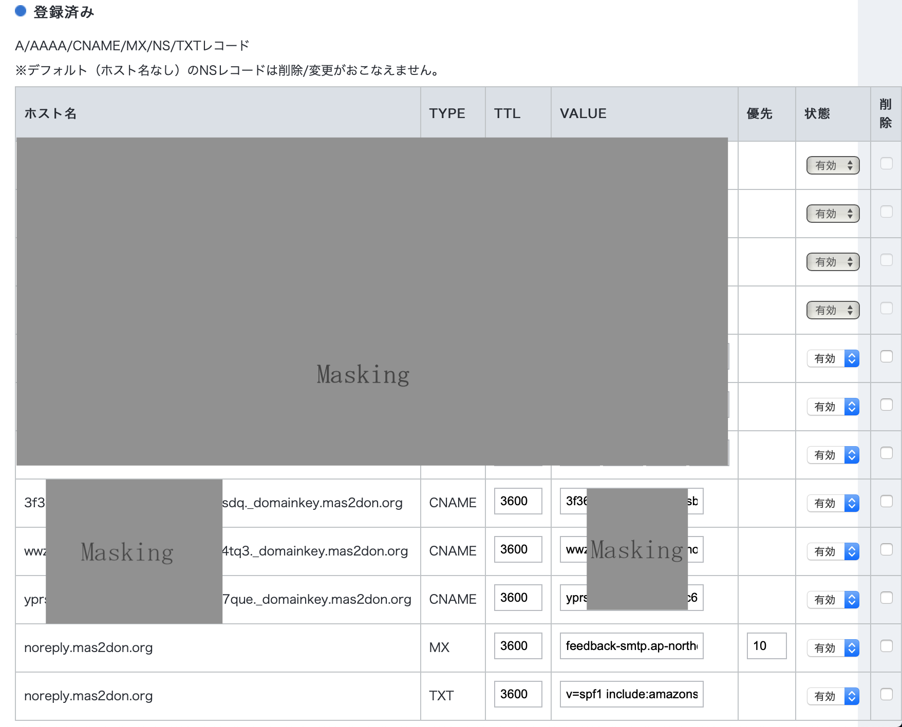

+++
author = "DUAN DAHAI"
title = "使用AWS的SES作为Mastodon的邮件送信服务"
date = "2022-11-30"
description = "使用AWS的SES作为Mastodon的邮件送信服务"
tags = [
    "AWS",
    "SES"
]
categories = [
    "Mastodon"
]
+++

#### 概要

本文为[基于云服务的Mastodon站点搭建](https://duandahai.com/zh-cn/posts/zh/20221125-mastodon-site-create.zh-cn/)的关于使用AWS的SES来发送邮件的扩展介绍。

#### IAM User

- 创建User，并为User增加SES的送信权限。  
    我的AWS账户中只有一个SES服务，下面的权限设置中没有区分Resource。

```json
{
    "Version": "2012-10-17",
    "Statement": [
        {
            "Effect": "Allow",
            "Action": "ses:SendRawEmail",
            "Resource": "*"
        }
    ]
}
```
- 为创建User增加access key，随后作为SMTP认证用

#### 创建SES的Identity

- 创建identity，设置Domain为你的域名  


- 设置你送信用的邮箱地址   


- 设置identity的类型  


- 将生成的CNAME记录，追加到你域名的DNS记录中  


- 将生成的MX和TXT记录，追加到你域名的DNS记录中  


- 追加后的DNS记录里面，CNAME,MX和TXT记录如下  



#### 申请解除SES的送信限制
在上面的Identity验证成功的基础上，向AWS support发送增加送信次数的申请[申请](https://docs.aws.amazon.com/ses/latest/dg/manage-sending-quotas-request-increase.html)。

#### Mastodon配置文件更新（.env.production）
如果你是按照官方教程配置的话，你的.env.production在/home/mastodon/live下面放着。  
更新.env.production里面关于文件存储的以下设置。

| 参数名 | 设定值 |
| ------ | ------ |
| SMTP_SERVER | SMTP主机服务器，例：email-smtp.ap-northeast-1.amazonaws.com |
| SMTP_PORT | 587 |
| SMTP_LOGIN | 你为使用SES创建的User的access key id |
| SMTP_PASSWORD | 你为使用SES创建的User的access key secret |
| SMTP_AUTH_METHOD | none |
| SMTP_OPENSSL_VERIFY_MODE | none |
| SMTP_FROM_ADDRESS | 验证过的送信邮箱，例：noreply@mas2don.org |
(https://docs.joinmastodon.org/admin/config/#s3_alias_host)的介绍 |

#### 其他
Identity验证最多会花费72小时，建议仔细检查CNAME，MX,TXT的DNS记录是否设置正确，以免耽误等待时间。

