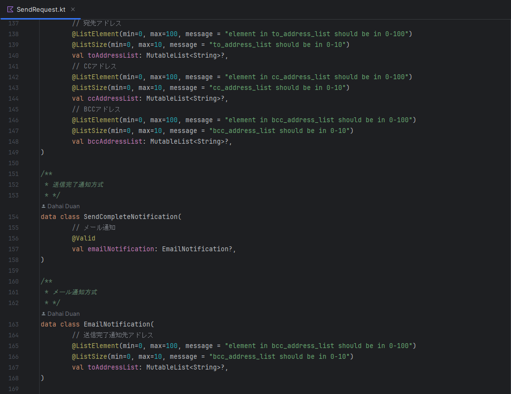
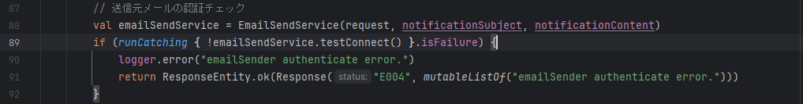
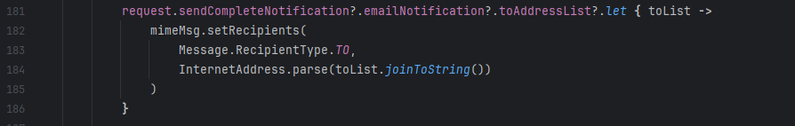

+++
author = "DUAN DAHAI"
title = "Kotlin构筑API服务初体验"
date = "2023-03-18"
description = "Kotlin构筑API服务初体验"
tags = [
    "Kotlin",
    "Java"
]
categories = [
    "解决方案"
]
+++

#### 背景   
前些年Oracle发行的JDK开始收费以后，日本业务开发中出现了一些从Java转Kotlin的项目，一直没有怎么了解过，直到最近接触了一个使用Kotlin开发安卓的项目，才发现Kotlin使用起来居然这么香。   
Java中繁杂的用法，以及为了向后兼容保留的过时语法功能，Kotlin全部精准对症下药，用最流行最先进手法进行了更新。至于哪些是Kotlin原创，哪些是参考其他语言并不重要，重要的是Kotlin兼容Java生态的同时，又解决了java的痛点，并且更大的惊喜是，Kotlin还是一位全能型选手，前端后台，脚本服务器，iOS安卓，桌面应用，Web开发等都可使用，目前为止最广为人知的是Google选Kotlin作为安卓开发的官方推荐语言，很多人们的印象就是Kotlin只用来开发安卓应用，对于这么优秀的一门语言来说有些稍微的可惜，不过Kotlin也在研发自己的编译器，相信不久Kotlin会让人们再重新认识它的，忽然感觉华为鸿蒙也是走的同样的路子哎。   

安利了这么多kotlin，肯定要拿出点证据看看了，所以公司内部一个新的产品就使用Kotlin+springboot试试水，不要笑，Java有的支持，Kotlin同样也有，甚至更好比如gradle。   
虽然项目较小，但是整体下来感觉Kotlin+springboot+idea+gradle这一套用着好顺畅，不像安卓开发那样会用到很多coroutine，callback或者匿名方法，这里用到的几个Kotlin特性贴给大家观摩一下。

#### Data class in Kotlin   
Kotlin中的Data Class用着实在是太舒服，虽然现在Java生态有了进化版的lombok，但是用起来还是没有Kotlin原生的Data Class方便啊。  
另外，变数定义时的？也是保障数据以及程序健壮的利器，同时也节省无数非空的if判断，这个在后面介绍。 

#### Catch Exception in Kotlin   
Kotlin中有像Java一样可以写作代码块的try catch写法，也有将try catch作为一个匿名函数式的写法，还有像下面这样作为一个表达式的写法，
省却了Java传统写法的一堆代码，真心好用。   

#### Null safety in Kotlin   
Kotlin中的Null安全机制既保证程序健壮，又减少了代码层面冗余，个人认为是非常好的设计。   
如果是这样的代码放到Java中去写，非空判断不得嵌套好几层啊。   

#### 最后    
安卓开发时接触了Kotlin很多哇塞的特性，鉴于这个项目规模较小且简单，能窥到的我想也足够让人对Kotlin产生兴趣了。
每一门语言以及其生态都在不断的发展，我们生在这个时代，不说引领变化了，至少赶上潮流不落伍才能说经历了时代的变迁，自己的铁饭碗才不会丢。