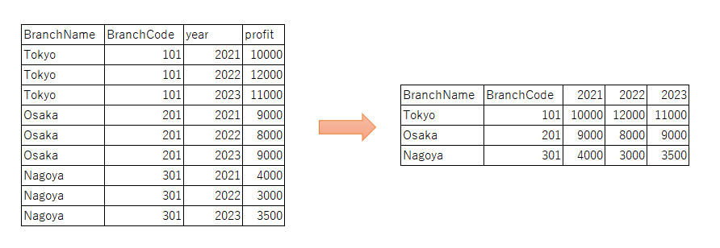

+++
author = "DUAN DAHAI"
title = "使用pandas的pivot反转数据的行列"
date = "2023-05-05"
description = "使用pandas的pivot反转数据的行列"
tags = [
    "python",
    "pivot",
]
categories = [
    "解决方案"
]
+++

#### 背景   
前几年做数据分析项目时，有遇到反转数据行列的用例，如今又碰到了，使用框架实现起来虽然很简单，但还是记录下来给新人参考一下吧。   

#### 解决方案   
无论以前做的数据分析还是现在做的Web服务，开发语言用的都是python，所以在这个生态中很容易就考虑到用pandas实现数据行列反转。   
panda中有多种可以实现数据反转的方法，本文只列举业务开发中最常用到的一种用例。

#### 业务数据背景   
需要将下图的年份列中的相同行作为列名输出   


#### Python实现代码
```Python
import pandas as pd


df_before = pd.DataFrame(
    [
        ("Tokyo", "101", "2021", "10000"),
        ("Tokyo", "101", "2022", "12000"),
        ("Tokyo", "101", "2023", "11000"),
        ("Osaka", "201", "2021", "9000"),
        ("Osaka", "201", "2022", "8000"),
        ("Osaka", "201", "2023", "9000"),
        ("Nagoya", "301", "2021", "4000"),
        ("Nagoya", "301", "2022", "3000"),
        ("Nagoya", "301", "2023", "3500")
    ],
    columns= ("BranchName", "BranchCode", "year", "profit")
)

df_after = df_before.pivot(
    index=["BranchName", "BranchCode"],
    columns=["year"],
    values="profit"
)
print(df_after.reset_index())
```

#### 输出结果
```Python
year BranchName BranchCode   2021   2022   2023
0        Nagoya        301   4000   3000   3500
1         Osaka        201   9000   8000   9000
2         Tokyo        101  10000  12000  11000
```

#### 最后
+ 上述代码的所用到pandas中的pivot方法，详细设定请参考[官方文档](https://pandas.pydata.org/docs/reference/api/pandas.DataFrame.pivot.html)
+ 还有其他可用于行列反转的方法有pivot_table, melt, stack, unstack等，实际业务中可根据需求选用适合的方法。