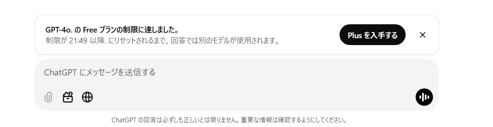
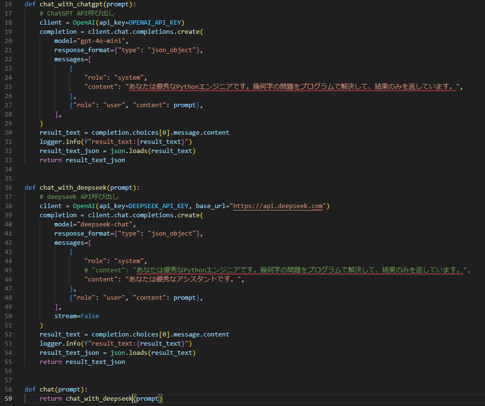

+++
author = "DUAN DAHAI"
title = "DeepSeek vs ChatGPT：谁是真香？"
date = "2025-01-28"
description = "DeepSeek和ChatGPT的使用体验对比，以及个人对AI革命的思考"
tags = [
    "AI工具",
    "DeepSeek",
    "ChatGPT",
    "开发者体验",
]
categories = [
    "技术对比"
]
+++

#### 背景   
最近一年多来，无论是公司内部还是客户现场的项目，同时并行开发着多个生成式AI的项目，而且个人工作中也大量使用着生成式AI。最近总是受到ChatGPT的使用时间限制，作为一款产品，确保盈利很重要，但是为了盈利打断用户的工作，却让人非常非常恼火，直到试了大火DeepSeek，终于让我解放并吐露了那句真言，同时DeepSeek的价格还是ChatGPT的1/20, 果断将公司的所有生成式AI服务全部转到DeepSeek上。   

#### DeepSeek使用初步感觉  
同样的业务放在DeepSeek上的结果，精确度明显提高，价格更是没得说，可能和我之前使用的是gpt-4o-mini有关吧，毕竟gpt-4o价格太贵了。   
重要业务为了不中断, 也可以考虑同时使用两者。   

#### AI时代：个人的一点点思考
在这个AI的时代，无论是技术还是业务创新，所产生的价值都将会被成几何倍放大，无论作为普通的开发者还是企业经营者和投资者，将创新作为重要价值取向，虽然会伴随着可能的失败和挫折，但对于成功无疑会是更巨大的。

#### 最后  
DeepSeek使用时间还比较短，但作为一个个人用户和业务用户，我更倾向于选择DeepSeek，因为它的准确性、便捷性和价格优势。当然，ChatGPT也有它的优点，希望它还是回归到用户身上来吧。
另外，现在影响比较大的另外一件事情就是，软银孙正义准备投资美国AI行业的5000亿美元，说真的难道没有一点风险了吗？

